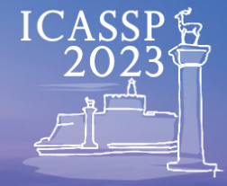

  
  

  <h3><b>Institute of Electrical and Electronics Engineers</b></h3>
  <h4><b>International Conference on Acoustics, Speech and Signal Processing</b></h2>

<!-- TABLE OF CONTENTS -->

# 📗 Table of Contents

- [📖 About the Project](#about-project)
  - [🛠 Built With](#built-with)
    - [Tech Stack](#tech-stack)
    - [Key Features](#key-features)
  - [🚀 Live Demo](#live-demo)
- [👥 Authors](#authors)
- [🔭 Future Features](#future-features)
- [🤝 Contributing](#contributing)
- [⭐️ Show your support](#support)
- [📝 License](#license)

<!-- PROJECT DESCRIPTION -->

# 📖 IEEE_ICASSP-Conference 

> IEEE_ICASSP-Conference is a project for Microverse Module 1 Program. It is a website based on the design of <a href="https://www.behance.net/gallery/29845175/CC-Global-Summit-2015">Cindy Shin in Behance</a> but modifaied for the 2023 IEEE-ICASSP event that will be held on Rhodes Islands, Greece.

**IEEE_ICASSP-Conference** is a website that gives detail information about the 2023 ICASSP Confrence, including events on the program, Registation options, about keynote speakers, Venues, Accomodations and Contact information.

## 🛠 Built With 

### Tech Stack 

  
Client

  <ul>
    <li><a href="https://getbootstrap.com/">BootStrap</a></li>
    <li><a href="http://vanilla-js.com/">JavaScript</a></li>
  </ul>

<!-- Features -->

### Key Features 
- **Responsive Web Page**
- **A Home Page with General Information**
- **Dynamic HTML generated from JS**

(<a href="#readme-top">back to top</a>)

<!-- LIVE DEMO -->

## 🚀 Live Demo 

- [Live Demo Link](https://log-benjamin.github.io/IEEE-ICASSP-Conference-Website)

(<a href="#readme-top">back to top</a>)

<!-- AUTHORS -->

## 👥 Authors 

👤 Binyam Tegene

- GitHub: [@githubhandle](https://github.com/Log-benjamin?tab=repositories)
- Twitter: [@twitterhandle](https://twitter.com/@binyam_tegene)
- LinkedIn: [LinkedIn](https://www.linkedin.com/in/binyam-tegene-4b77ab265)

(<a href="#readme-top">back to top</a>)

<!-- FUTURE FEATURES -->

## 🔭 Future Features 

- [ ] **[Add Backend Stack]**
- [ ] **[Impliment login and Sign up]**

(<a href="#readme-top">back to top</a>)

<!-- CONTRIBUTING -->

## 🤝 Contributing 

Contributions, issues, and feature requests are welcome!

Feel free to check the [issues page](https://github.com/Log-benjamin/IEEE-ICASSP-Conference/issues).

(<a href="#readme-top">back to top</a>)

<!-- SUPPORT -->

## ⭐️ Show your support 

If you like this project feel free to contact me or make contribution and share youre ideas.

(<a href="#readme-top">back to top</a>)

<!-- ACKNOWLEDGEMENTS -->

## 🙏 Acknowledgments 

  - To <a href="https://www.behance.net/gallery/29845175/CC-Global-Summit-2015">Cindy Shin in Behance</a>, original designer.
  - Creative Commons license of the design
  - Microverse.Org for giving the learning oppportunity
  - Microverse learning partners and teammates.

(<a href="#readme-top">back to top</a>)

<!-- LICENSE -->

## 📝 License 

This project is [MIT](https://github.com/Log-benjamin/IEEE-ICASSP-Conference-Website/blob/main/LICENSE) licensed.

(<a href="#readme-top">back to top</a>)

